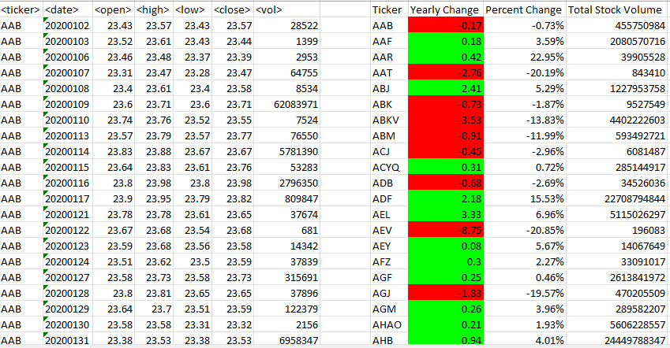

# Stock Market Data Analysis
Develop a VBA script to automate and enhance the analysis of yearly stock market data, focusing on key metrics like yearly change, percentage change, and total volume, for improved financial data analysis efficiency.

## Background
I am well on my way to becoming a programmer and Excel expert! In this challenge, I will use VBA scripting to analyze generated stock market data.

### Instructions

- Create a script that loops through all the stocks for one year and outputs the following information:
- The ticker symbol
- Yearly change from the opening price at the beginning of a given year to the closing price at the end of that year.
- The percentage change from the opening price at the beginning of a given year to the closing price at the end of that year.
- The total stock volume of the stock. The result should match the following image:

- Add functionality to this script to return the stock with the "Greatest % increase", "Greatest % decrease", and "Greatest total volume". The solution should match the following image:

- Make the appropriate adjustments to this VBA script to enable it to run on every worksheet (that is, every year) at once.

***Note***

Make sure to use conditional formatting that will highlight positive change in green and negative change in red.

#### Other Considerations
Use the alphabetical_testing.xlsx sheet while developing this code. This dataset is smaller and will allow me to test faster. This code should run on this file in under 3 to 5 minutes.
Make sure that the script acts the same on every sheet. The joy of VBA is that it takes the tediousness out of repetitive tasks with the click of a button.

##### Submission 
All three of the following are uploaded to GitHub:
- Screenshots of the results
- Separate VBA script files
- README file

***References***.

Data for this dataset was generated by edX Boot Camps LLC.
