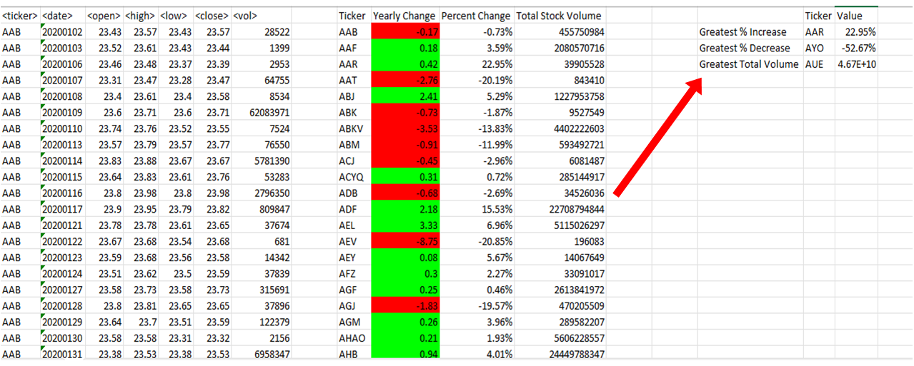

# Stock Market Data Analysis

## Background
As I progress towards becoming a programmer and Excel expert, I've undertaken a challenge to use VBA scripting to analyze stock market data.

### Objective
Develop a VBA script that efficiently processes and analyzes stock market data across multiple sheets. This script will focus on key metrics such as yearly price changes, percentage changes, and total stock volume. Additionally, it identifies stocks with the greatest percentage increase, decrease, and total trading volume.

### Purpose
The creation of the VBA script aims to provide a comprehensive tool for automating the analysis of stock market trends. This tool is designed to save significant time and offer valuable insights into stock performance, assisting in more informed investment decision-making.

### Instructions

- Create a script that loops through all stocks for one year, outputting the following information:
  - The ticker symbol
  - Yearly change from the opening price at the beginning of the year to the closing price at the end of that year
  - The percentage change from opening to closing price
  - The total stock volume of the stock
  
  The results should match the following image:
  

The above financial data in the image shows a spreadsheet with stock information:

**Ticker:** This is a unique symbol for a stock. Here, all entries seem to be for the same stock (AAB).
**Date:** It indicates the date for each stock data entry, in the format yyyymmdd.
**Open:** The price of the stock at the beginning of the trading day.
**High:** The highest price of the stock during the trading day.
**Low:** The lowest price of the stock during the trading day.
**Close:** The price of the stock at the end of the trading day.
**Volume:** This shows how many shares of the stock were traded during the day.

On the right side of the image, there's a summary:
**Yearly Change:** The difference between the opening price at the beginning of the year and the closing price on the date provided. It's negative if the price falls and positive if it rises.
**Percent Change:** This is the Yearly Change expressed as a percentage.
**Total Stock Volume:** The sum of all shares traded for this stock.

The summary section also highlights the stock with the highest percent increase, the highest percent decrease, and the greatest total volume of shares traded.

In simple terms, this data tells you how much the stock's price fluctuated, and how much of it was traded, on each given day. It also summarizes the stock's overall performance and trading activity.

- Enhance the script to identify the stock with the "Greatest % increase", "Greatest % decrease", and "Greatest total volume". The output should resemble the following image:

- Adjust the VBA script to enable it to run across every worksheet (i.e., every year) simultaneously.

### Outcomes
- **Ticker AAR:** Demonstrated the greatest price increase (+22.95%), indicating strong performance and potential for further growth. Investors might consider buying or holding.
- **Ticker AYO:** Exhibited a significant decrease (-52.67%), presenting a potential risk. This might lead investors to sell or avoid, depending on their recovery assessment.
- **Ticker AUE:** Achieved the greatest total volume, suggesting high interest, possibly due to positive news or speculation, and warrants further investigation by investors.

### Recommendation
Considering the inherent risks of the stock market, it's crucial to take into account overall market conditions, personal investment goals, and risk tolerance. Therefore, consulting with a financial advisor before making any buy or sell decisions is strongly recommended.

**Note:**
Ensure to use conditional formatting that highlights positive changes in green and negative changes in red.

#### Other Considerations
During development, I used the `alphabetical_testing.xlsx` sheet for faster testing. This dataset is smaller and allows for quicker tests. Ensure the script performs consistently across all sheets. VBA automates repetitive tasks efficiently with just a button click.

##### Submission
The following items are uploaded to GitHub:
- Screenshots of the results
- Separate VBA script files
- This README file

**References**

Data for this dataset was generated by edX Boot Camps LLC.
